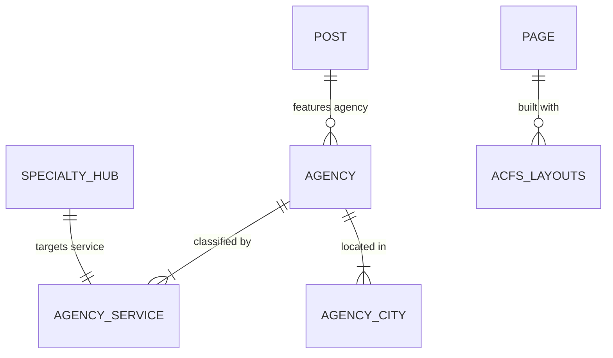

# Database Schema & CPT Relationships

This document details the data relationships between our Custom Post Types, Taxonomies, and Custom Fields (ACF).

---

## 1. Visual Entity Relationship Diagram

The diagram below shows how the different post types, taxonomies, and layout groups connect:

---

## 2. Schema Fields & Attributes Directory

### CPT: Agency (`agency`)
* **Standard Fields:** Title, Excerpt (for descriptions), Featured Image (if custom logo upload is preferred).
* **Taxonomies:** `agency_service`, `agency_city`.
* **ACF Custom Fields:**
  * `logo_text` (Text) — Initials logo fallback (e.g. `RMD`).
  * `logo_image` (Image) — Vetted custom image logo file.
  * `rating_value` (Text) — Lighthouse average rating score (e.g. `4.9`).
  * `review_count` (Text) — Count of verified reviews (e.g. `42`).
  * `agency_rank` (Text) — Leaderboard rank position (e.g. `1`).
  * `budget` (Text) — Minimum monthly project budget (e.g. `15,000 MAD/mo`).
  * `project` (Text) — Average campaign project scope (e.g. `50K-200K MAD`).
  * `team_size` (Text) — Count of team employees (e.g. `25-50`).
  * `clients_served` (Text) — Historic customer totals (e.g. `150+`).
  * `founded` (Text) — Year established (e.g. `2018`).
  * `address` (Text) — Local office address details.
  * `email` (Email) — Contact email address.
  * `phone` (Text) — Contact phone number.
  * `website` (Text) — Company website redirection link.
  * `pagespeed_score` (Number) — Technical Lighthouse speed index (0-100).
  * `core_web_vitals` (Select) — `PASS` / `FAIL` performance status.
  * `code_cleanliness` (Number) — Performance cleanliness index percentage.
  * `case_studies` (Repeater) — Vetted portfolio case listings:
    * `title` (Text) — Case study headline.
    * `tag` (Text) — Optimization channel / taxonomy category.
  * `why_listed` (Repeater) — Points explaining why the agency was chosen:
    * `point_text` (Text) — Detailed criteria check.

### CPT: Specialty Hub (`specialty_hub`)
* **ACF Custom Fields:**
  * `icon_svg` (Textarea) — Raw XML markup for Lucide Icon tags.
  * `direct_link_parameter` (Text) — Target taxonomy slug filter map (e.g. `seo`).
  * `sub_services` (Repeater) — Checklist items:
    * `service_name` (Text) — Service bullet.

### CPT: Stat Metric (`stat_metric`)
* **ACF Custom Fields:**
  * `stat_number` (Text) — Vitals count (e.g. `150+`).
  * `stat_label` (Text) — Metric description label.

### CPT: Partner Logo (`partner_logo`)
* **Standard Fields:** Title (Company name).
* **Featured Image:** File upload for partner logo image.

### Post Type: Blog Post (`post`)
* **Standard Fields:** Title, Content (Body text), Featured Image, Author, Date.
* **Taxonomies:** Category (Ranking, Guide, Comparison).
* **ACF Custom Fields:**
  * `embedded_listings` (Relationship) — Linked CPT `agency` posts featured inside the article layout.

---

## 3. ACF Page Layouts (`page_layouts` Flexible Content)

* **`hero_section`**: Top header panel, lede paragraph, search/filter inputs.
* **`challenge`**: The problem section, bullet points, and verified CMO quote.
* **`how_we_solve`**: Editorial processes and comparison benchmarks.
* **`stats_band`**: Pulls and counts values from CPT `stat_metric` items.
* **`editors_picks`**: Queries and displays top-rated listings from CPT `agency`.
* **`specialties`**: Grid displays items from CPT `specialty_hub`.
* **`trust`**: Editorial guidelines checklist and link to methodology.
* **`footer_cta`**: Standard matchmaking prompt at the bottom of pages.
