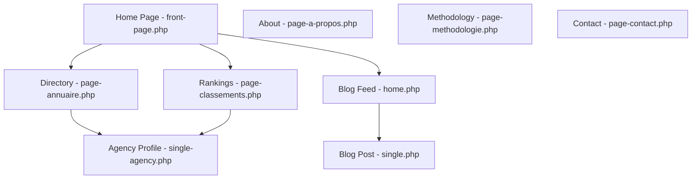

# Website Sitemap & Template Mapping

This document maps the static HTML files from the mockup directory directly to the corresponding WordPress theme templates and permalink routes.

---

## 1. Page Mapping Directory

The table below maps each file in the mockup to its dynamic WordPress equivalent:

| Mockup File | Page Name | WordPress Template File | French Route (Default) | English Route |
| :--- | :--- | :--- | :--- | :--- |
| `index.html` | Home Page | `front-page.php` | `/` | `/en/` |
| `directory.html` | Directory Listing | `page-annuaire.php` or `archive-agency.php` | `/annuaire/` | `/en/directory/` |
| `profile.html` | Agency Profile | `single-agency.php` | `/agence/%postname%/` | `/en/agency/%postname%/` |
| `rankings.html` | Rankings | `page-classements.php` | `/classements/` | `/en/rankings/` |
| `blog.html` | Blog Index | `home.php` (or `page-blog.php`) | `/blog/` | `/en/blog/` |
| `article.html` | Blog Article | `single.php` | `/blog/%postname%/` | `/en/blog/%postname%/` |
| `about.html` | About Page | `page-a-propos.php` | `/a-propos/` | `/en/about/` |
| `methodology.html` | Methodology | `page-methodologie.php` | `/methodologie/` | `/en/methodology/` |
| `contact.html` | Contact Page | `page-contact.php` | `/contact/` | `/en/contact/` |

---

## 2. Dynamic Routing & Filter Mappings

In the mockup, location and channel filtering are handled using JavaScript query parameters. In the final WordPress theme, these filter mappings will translate directly into dynamic queries:

* **Service Filters** (e.g. `service=SEO`):
  Maps to the custom taxonomy `agency_service`. In WordPress, entering `/service/seo/` will automatically display the pre-filtered SEO agency listings using the standard taxonomy template `taxonomy-agency_service.php` (reusing the directory design layout).
* **City Filters** (e.g. `city=Casablanca`):
  Maps to the custom taxonomy `agency_city`. In WordPress, entering `/ville/casablanca/` will display the Casablanca pre-filtered list using `taxonomy-agency_city.php`.

---

## 3. Site Navigation & Flow Graph

